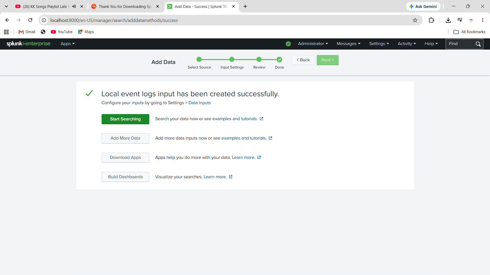
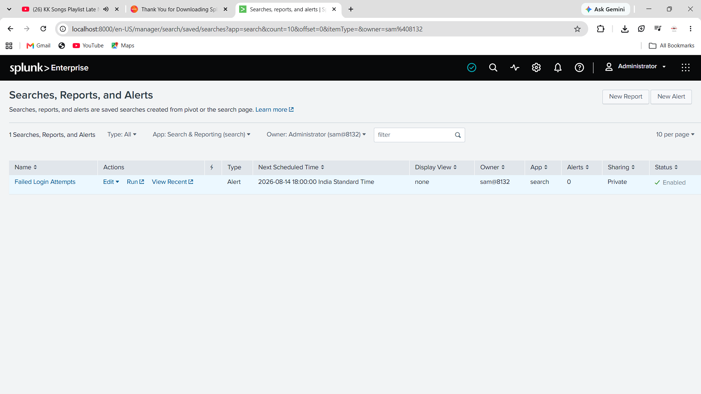
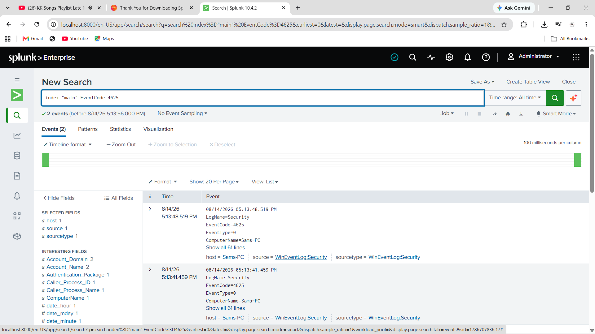
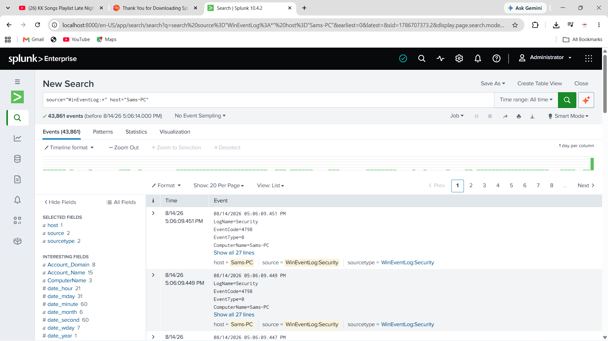

# SIEM-Log-Analysis-Alert-Dashboard
SOC project-Splunk-based log monitoring and alerting for failed login detection.

##  Objective
Configured a SIEM solution using **Splunk Enterprise** to monitor Windows Security Event Logs, detect failed login attempts, and generate automated alerts for suspicious authentication activity.

## Tools Used
- Splunk Enterprise (Free version)
- Windows Event Logs (Security)

## Steps Performed

**1. Configured Data Input**
Set up Splunk to collect local Windows Event Logs (Security channel) as a monitored data source.

**2. Verified Log Ingestion**
Confirmed successful ingestion of Windows Security logs (43,861+ events collected) using the query:

**3. Detected Failed Login Attempts**
Used Windows Event Code **4625** (Failed Logon) to filter and identify unsuccessful login attempts:

**4. Configured Automated Alert**
Created a scheduled alert ("Failed Login Attempts") that runs hourly and triggers when failed login events are detected, enabling proactive monitoring.

## Key Learnings
- Hands-on experience configuring a SIEM tool for log collection and monitoring.
- Practical understanding of Windows Security Event Codes (e.g., 4625 for failed logons).
- Built and scheduled automated alerts for real-time-style threat detection.
- Learned the end-to-end SOC workflow: data ingestion → search/filter → alerting.
